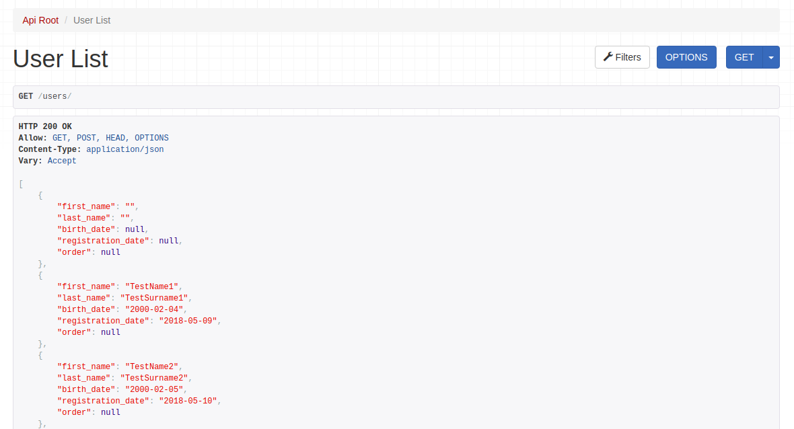

# Shop project

Project for management user and orders

## Getting Started

These instructions will get you a copy of the project up and running on your local machine for development and testing purposes.

### Installing

Create the project directory (for example 'shop')
```
mkdir shop
cd shop
```

Clone the repository to this folder

```
git clone https://github.com/Vitamal/shop
```

### Create a virtual environment to isolate our package dependencies locally
```
python3 -m venv env
source env/bin/activate  # On Windows use `env\Scripts\activate`
```

## Install dependencies

```
cd shop
pip install -r requirements/develop.txt
```

## Now sync your database for the first time
```
python manage.py migrate
```
## Create an initial user named admin with a password ...

```
python manage.py createsuperuser --email admin@example.com --username admin
```

## Running the project

```
python manage.py runserver
```

## Import users from csv file 
In browser open http://127.0.0.1:8000/admin  
Login as admin.  Go to the user list, press button "Import from csv file", choose the csv file for import and press Import button.

## Get the user list
To get the user list goto the  http://127.0.0.1:8000/users/ page.  
Or go to the http://127.0.0.1:8000/user_list/ page. 
You get the user list in JSON format:




## Built With

* [Django 3.1.3](https://pypi.org/project/Django/) - The web framework used
* [Python 3.8.5 ](https://www.python.org/doc/) 
* [pip 20.2.4](https://pypi.org/project/pip/) - The tool for installing Python packages.
